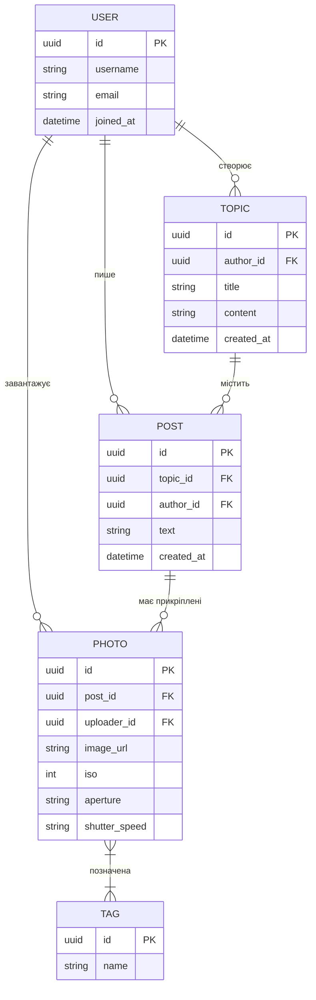

```mermaid
erDiagram
    USER {
        uuid id PK
        string username
        string email
        datetime joined_at
    }
    
    TOPIC {
        uuid id PK
        uuid author_id FK
        string title
        string content
        datetime created_at
    }
    
    POST {
        uuid id PK
        uuid topic_id FK
        uuid author_id FK
        string text
        datetime created_at
    }
    
    PHOTO {
        uuid id PK
        uuid post_id FK
        uuid uploader_id FK
        string image_url
        int iso
        string aperture
        string shutter_speed
    }
    
    TAG {
        uuid id PK
        string name
    }

    %% Опис зв'язків
    USER ||--o{ TOPIC : "створює"
    USER ||--o{ POST : "пише"
    USER ||--o{ PHOTO : "завантажує"
    TOPIC ||--o{ POST : "містить"
    POST ||--o{ PHOTO : "має прикріплені"
    PHOTO }|--|{ TAG : "позначена"
```