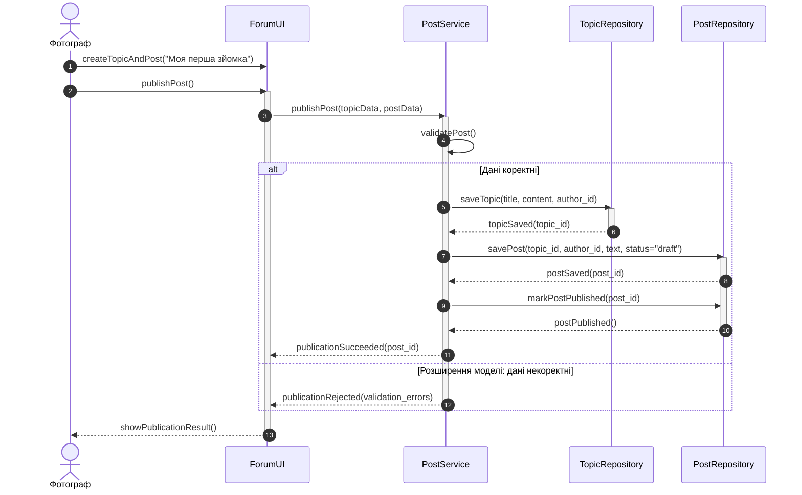

# UC-01 - Публікація допису без фотографій

```mermaid
sequenceDiagram
    autonumber
    actor Photographer as Фотограф
    participant UI as ForumUI
    participant PostService as PostService
    participant TopicRepository as TopicRepository
    participant PostRepository as PostRepository

    Photographer->>UI: createTopicAndPost("Моя перша зйомка")
    Photographer->>UI: publishPost()
    activate UI
    UI->>PostService: publishPost(topicData, postData)
    activate PostService
    PostService->>PostService: validatePost()
    alt Дані коректні
        PostService->>TopicRepository: saveTopic(title, content, author_id)
        activate TopicRepository
        TopicRepository-->>PostService: topicSaved(topic_id)
        deactivate TopicRepository
        PostService->>PostRepository: savePost(topic_id, author_id, text, status="draft")
        activate PostRepository
        PostRepository-->>PostService: postSaved(post_id)
        PostService->>PostRepository: markPostPublished(post_id)
        PostRepository-->>PostService: postPublished()
        deactivate PostRepository
        PostService-->>UI: publicationSucceeded(post_id)
    else Розширення моделі: дані некоректні
        PostService-->>UI: publicationRejected(validation_errors)
    end
    deactivate PostService
    UI-->>Photographer: showPublicationResult()
    deactivate UI
```
