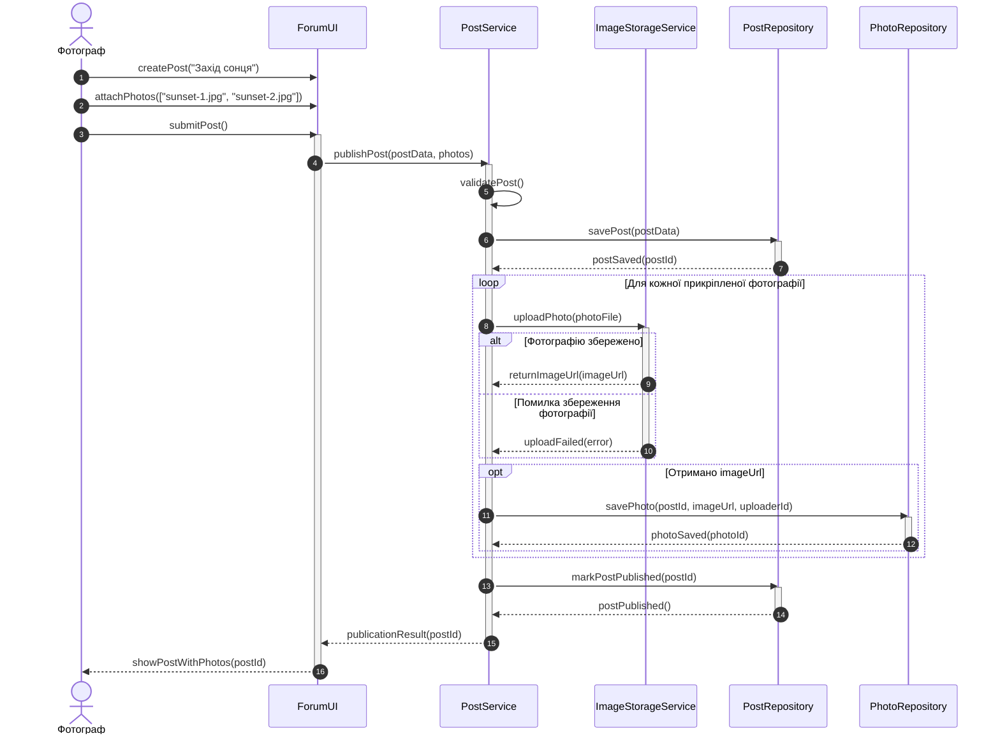

# UC-02 - Публікація допису з фотографіями

```mermaid
sequenceDiagram
    autonumber
    actor Photographer as Фотограф
    participant UI as ForumUI
    participant PostService as PostService
    participant ImageStorage as ImageStorageService
    participant PostRepository as PostRepository
    participant PhotoRepository as PhotoRepository

    Photographer->>UI: createPost("Захід сонця")
    Photographer->>UI: attachPhotos(["sunset-1.jpg", "sunset-2.jpg"])
    Photographer->>UI: submitPost()
    activate UI
    UI->>PostService: publishPost(postData, photos)
    activate PostService
    PostService->>PostService: validatePost()
    PostService->>PostRepository: savePost(postData)
    activate PostRepository
    PostRepository-->>PostService: postSaved(postId)
    deactivate PostRepository

    loop Для кожної прикріпленої фотографії
        PostService->>ImageStorage: uploadPhoto(photoFile)
        activate ImageStorage
        alt Фотографію збережено
            ImageStorage-->>PostService: returnImageUrl(imageUrl)
        else Помилка збереження фотографії
            ImageStorage-->>PostService: uploadFailed(error)
        end
        deactivate ImageStorage
        opt Отримано imageUrl
            PostService->>PhotoRepository: savePhoto(postId, imageUrl, uploaderId)
            activate PhotoRepository
            PhotoRepository-->>PostService: photoSaved(photoId)
            deactivate PhotoRepository
        end
    end
    PostService->>PostRepository: markPostPublished(postId)
    activate PostRepository
    PostRepository-->>PostService: postPublished()
    deactivate PostRepository
    PostService-->>UI: publicationResult(postId)
    deactivate PostService
    UI-->>Photographer: showPostWithPhotos(postId)
    deactivate UI
```