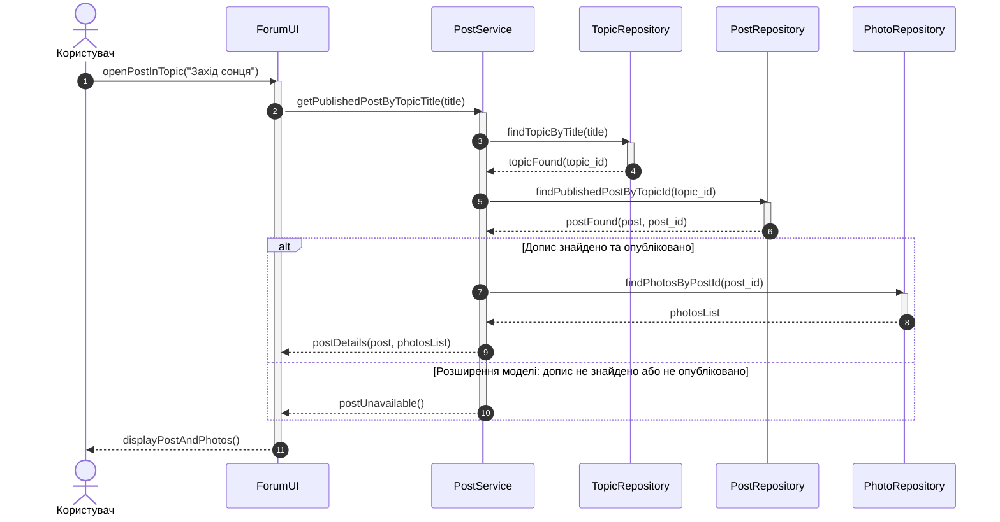

# UC-03 - Перегляд опублікованого допису з фотографіями

```mermaid
sequenceDiagram
    autonumber
    actor User as Користувач
    participant UI as ForumUI
    participant PostService as PostService
    participant TopicRepository as TopicRepository
    participant PostRepository as PostRepository
    participant PhotoRepository as PhotoRepository

    User->>UI: openPostInTopic("Захід сонця")
    activate UI
    UI->>PostService: getPublishedPostByTopicTitle(title)
    activate PostService
    PostService->>TopicRepository: findTopicByTitle(title)
    activate TopicRepository
    TopicRepository-->>PostService: topicFound(topic_id)
    deactivate TopicRepository
    PostService->>PostRepository: findPublishedPostByTopicId(topic_id)
    activate PostRepository
    PostRepository-->>PostService: postFound(post, post_id)
    deactivate PostRepository
    alt Допис знайдено та опубліковано
        PostService->>PhotoRepository: findPhotosByPostId(post_id)
        activate PhotoRepository
        PhotoRepository-->>PostService: photosList
        deactivate PhotoRepository
        PostService-->>UI: postDetails(post, photosList)
    else Розширення моделі: допис не знайдено або не опубліковано
        PostService-->>UI: postUnavailable()
    end
    deactivate PostService
    UI-->>User: displayPostAndPhotos()
    deactivate UI
```
