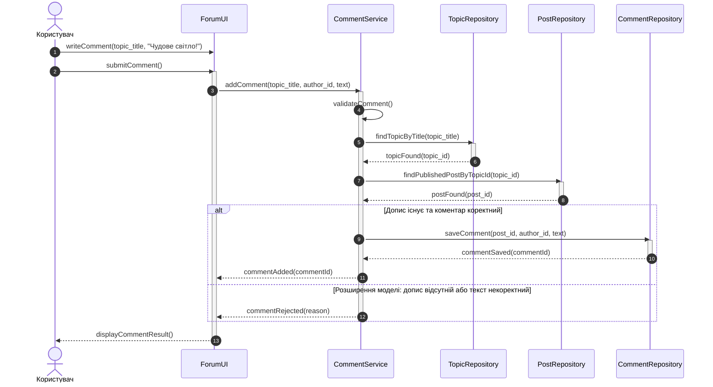

# UC-04 - Додавання коментаря до допису

```mermaid
sequenceDiagram
    autonumber
    actor User as Користувач
    participant UI as ForumUI
    participant CommentService as CommentService
    participant TopicRepository as TopicRepository
    participant PostRepository as PostRepository
    participant CommentRepository as CommentRepository

    User->>UI: writeComment(topic_title, "Чудове світло!")
    User->>UI: submitComment()
    activate UI
    UI->>CommentService: addComment(topic_title, author_id, text)
    activate CommentService
    CommentService->>CommentService: validateComment()
    CommentService->>TopicRepository: findTopicByTitle(topic_title)
    activate TopicRepository
    TopicRepository-->>CommentService: topicFound(topic_id)
    deactivate TopicRepository
    CommentService->>PostRepository: findPublishedPostByTopicId(topic_id)
    activate PostRepository
    PostRepository-->>CommentService: postFound(post_id)
    deactivate PostRepository
    alt Допис існує та коментар коректний
        CommentService->>CommentRepository: saveComment(post_id, author_id, text)
        activate CommentRepository
        CommentRepository-->>CommentService: commentSaved(commentId)
        deactivate CommentRepository
        CommentService-->>UI: commentAdded(commentId)
    else Розширення моделі: допис відсутній або текст некоректний
        CommentService-->>UI: commentRejected(reason)
    end
    deactivate CommentService
    UI-->>User: displayCommentResult()
    deactivate UI
```