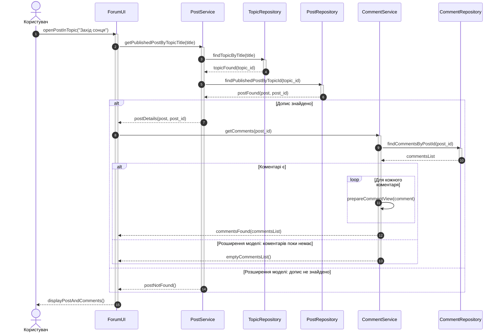

# UC-05 - Перегляд коментарів до допису

```mermaid
sequenceDiagram
    autonumber
    actor User as Користувач
    participant UI as ForumUI
    participant PostService as PostService
    participant TopicRepository as TopicRepository
    participant PostRepository as PostRepository
    participant CommentService as CommentService
    participant CommentRepository as CommentRepository

    User->>UI: openPostInTopic("Захід сонця")
    activate UI
    UI->>PostService: getPublishedPostByTopicTitle(title)
    activate PostService
    PostService->>TopicRepository: findTopicByTitle(title)
    activate TopicRepository
    TopicRepository-->>PostService: topicFound(topic_id)
    deactivate TopicRepository
    PostService->>PostRepository: findPublishedPostByTopicId(topic_id)
    activate PostRepository
    PostRepository-->>PostService: postFound(post, post_id)
    deactivate PostRepository
    alt Допис знайдено
        PostService-->>UI: postDetails(post, post_id)
        UI->>CommentService: getComments(post_id)
        activate CommentService
        CommentService->>CommentRepository: findCommentsByPostId(post_id)
        activate CommentRepository
        CommentRepository-->>CommentService: commentsList
        deactivate CommentRepository
        alt Коментарі є
            loop Для кожного коментаря
                CommentService->>CommentService: prepareCommentView(comment)
            end
            CommentService-->>UI: commentsFound(commentsList)
        else Розширення моделі: коментарів поки немає
            CommentService-->>UI: emptyCommentsList()
        end
        deactivate CommentService
    else Розширення моделі: допис не знайдено
        PostService-->>UI: postNotFound()
    end
    deactivate PostService
    UI-->>User: displayPostAndComments()
    deactivate UI
```

