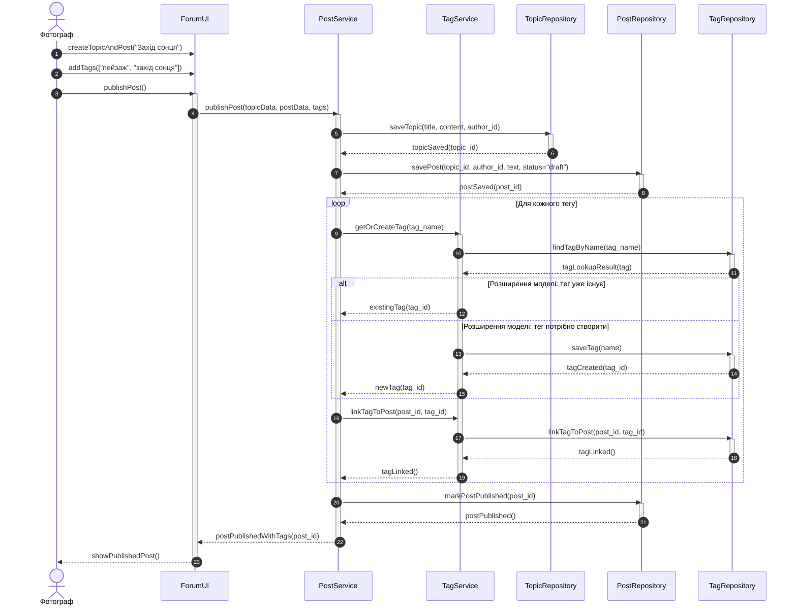

# UC-06 - Додавання тегів до допису

```mermaid
sequenceDiagram
    autonumber
    actor Photographer as Фотограф
    participant UI as ForumUI
    participant PostService as PostService
    participant TagService as TagService
    participant TopicRepository as TopicRepository
    participant PostRepository as PostRepository
    participant TagRepository as TagRepository

    Photographer->>UI: createTopicAndPost("Захід сонця")
    Photographer->>UI: addTags(["пейзаж", "захід сонця"])
    Photographer->>UI: publishPost()
    activate UI
    UI->>PostService: publishPost(topicData, postData, tags)
    activate PostService
    PostService->>TopicRepository: saveTopic(title, content, author_id)
    activate TopicRepository
    TopicRepository-->>PostService: topicSaved(topic_id)
    deactivate TopicRepository
    PostService->>PostRepository: savePost(topic_id, author_id, text, status="draft")
    activate PostRepository
    PostRepository-->>PostService: postSaved(post_id)
    deactivate PostRepository
    loop Для кожного тегу
        PostService->>TagService: getOrCreateTag(tag_name)
        activate TagService
        TagService->>TagRepository: findTagByName(tag_name)
        activate TagRepository
        TagRepository-->>TagService: tagLookupResult(tag)
        deactivate TagRepository
        alt Розширення моделі: тег уже існує
            TagService-->>PostService: existingTag(tag_id)
        else Розширення моделі: тег потрібно створити
            TagService->>TagRepository: saveTag(name)
            activate TagRepository
            TagRepository-->>TagService: tagCreated(tag_id)
            deactivate TagRepository
            TagService-->>PostService: newTag(tag_id)
        end
        PostService->>TagService: linkTagToPost(post_id, tag_id)
        TagService->>TagRepository: linkTagToPost(post_id, tag_id)
        activate TagRepository
        TagRepository-->>TagService: tagLinked()
        deactivate TagRepository
        TagService-->>PostService: tagLinked()
        deactivate TagService
    end
    PostService->>PostRepository: markPostPublished(post_id)
    activate PostRepository
    PostRepository-->>PostService: postPublished()
    deactivate PostRepository
    PostService-->>UI: postPublishedWithTags(post_id)
    deactivate PostService
    UI-->>Photographer: showPublishedPost()
    deactivate UI
```
